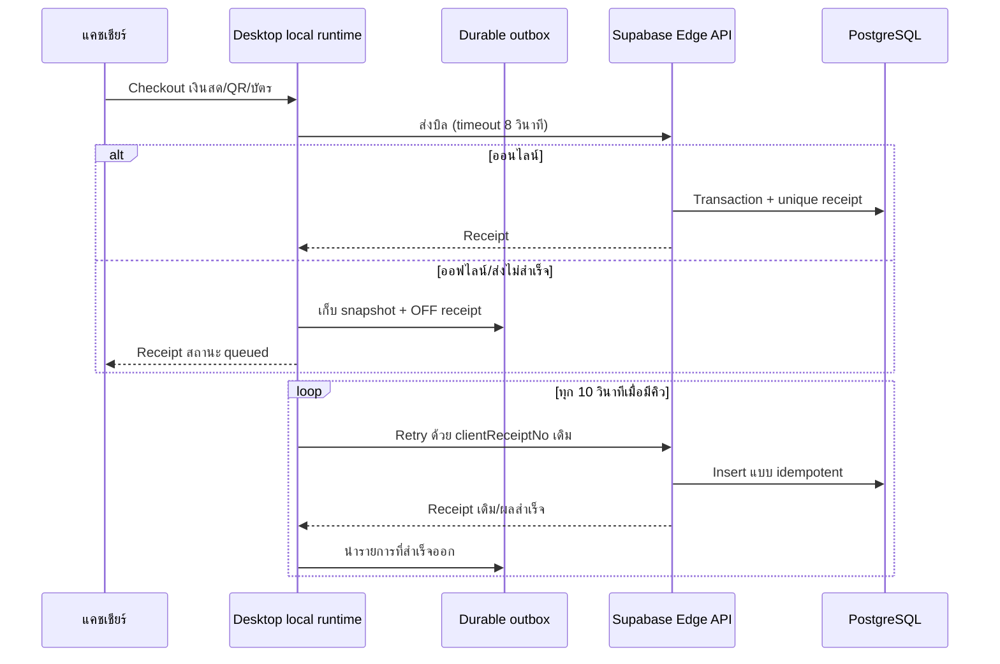
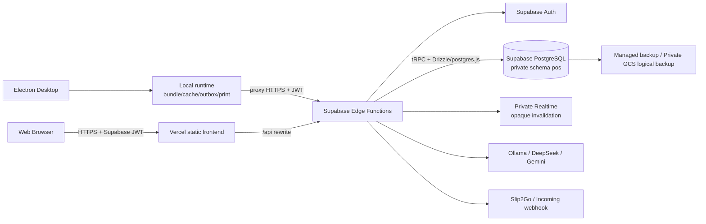

# Product Requirements Document (PRD) — PumpPOS

> ระบบ POS สำหรับปั๊มน้ำมัน: Web + Windows Desktop + Offline Sales
>
> สถานะเอกสาร: Baseline ตาม repository ณ วันที่ 4 สิงหาคม 2026<br>
> เวอร์ชัน source: `2.1.7`<br>
> Git snapshot ที่ใช้ตรวจสอบ: `1c91b61` บน branch `agent/fix-shift-reconciliation-cash-counts`<br>
> ขอบเขตประวัติ: 17 กรกฎาคม 2026 ถึง 4 สิงหาคม 2026 รวม 107 commits<br>
> หมายเหตุ: เอกสารนี้ยึดโค้ด, schema, tests และ Git history เป็นแหล่งความจริงหลัก เอกสารเดิมบางไฟล์อาจยังระบุเวอร์ชันหรือสถาปัตยกรรมก่อนหน้า

---

## 1. บทสรุปผลิตภัณฑ์

PumpPOS คือระบบบริหารงานปั๊มน้ำมันขนาดเล็กถึงกลางที่รวมงานขายหน้าลาน การเปิด–ปิดกะและอ่านมิเตอร์ ตู้/หัวจ่าย/ถังน้ำมัน สต๊อกสินค้า สมาชิก ลูกค้าธุรกิจและลูกหนี้ ใบกำกับภาษี ค่าใช้จ่าย บุคลากร เงินเดือน รายงาน การตรวจสอบย้อนหลัง การชำระผ่าน QR และผู้ช่วย AI ไว้ในระบบเดียว

ระบบรองรับ 3 ช่องทางใช้งานหลัก:

1. เว็บออนไลน์ผ่าน Vercel และ Supabase
2. Windows Desktop ผ่าน Electron และ Microsoft Store
3. Windows `.exe` แบบ NSIS/Portable เป็นช่องทางสำรอง

Desktop ใช้ frontend bundle ในเครื่องและเชื่อม API กลาง เมื่ออินเทอร์เน็ตขาดสามารถขายเงินสด, QR พร้อมเพย์ทั่วไป และบัตรได้โดยเก็บบิลใน durable outbox แล้วซิงก์อัตโนมัติเมื่อกลับมาออนไลน์ การขายเชื่อ การใช้แต้ม และงานที่ต้องยืนยันกับ server ต้องออนไลน์

คุณค่าหลักของผลิตภัณฑ์คือ:

- ลดการคีย์ข้อมูลซ้ำระหว่างบิลขาย กะ มิเตอร์ ถัง และรายงาน
- กระทบยอดน้ำมันและเงินสดได้จากข้อมูลหลายแหล่ง
- รองรับงานปั๊มโดยตรง เช่น มิเตอร์ `L`/`P`, nozzle-to-tank mapping และ tank reconciliation
- ให้ผู้บริหารตรวจสอบย้อนหลังด้วยสิทธิ์รายบทบาท รายเมนู สาขา และ Audit log
- ใช้งานต่อได้ในสถานการณ์อินเทอร์เน็ตไม่เสถียรโดยไม่สร้างบิลซ้ำเมื่อซิงก์

---

## 2. ปัญหาที่ต้องแก้

### 2.1 ปัญหาหน้างาน

- ยอดขายจาก POS, มิเตอร์ลิตร, มิเตอร์เงิน และเงินในลิ้นชักอาจไม่ตรงกัน
- การหักน้ำมันจากถังด้วยรายการขายทีละบิลไม่เท่ากับปริมาณที่หัวจ่ายจ่ายจริง
- การอ่านเลขมิเตอร์จำนวนมากด้วยมือเสี่ยงต่อการสลับหลักหรือคีย์ผิด
- อินเทอร์เน็ตที่ขาดชั่วคราวไม่ควรหยุดการขายหน้าลาน
- ปั๊มต้องออกใบเสร็จ ใบกำกับภาษี และรายงานปิดวันจากข้อมูลชุดเดียวกัน
- การขายเชื่อต้องควบคุมวงเงินและทราบยอดค้างชำระจริง
- หลายเครื่องและหลายสาขาต้องไม่เห็นหรือแก้ข้อมูลข้ามขอบเขตโดยไม่ได้รับอนุญาต

### 2.2 ปัญหาด้านการบริหาร

- ผู้จัดการต้องเห็นยอดขาย ค่าใช้จ่าย เงินสด ลูกหนี้ กำไรน้ำมัน และความผิดปกติของถัง
- ผู้ดูแลต้องควบคุมราคา สินค้า ตู้ หัวจ่าย ผู้ใช้ สิทธิ์ และเลขเอกสาร
- การแก้/ลบข้อมูลสำคัญต้องตรวจสอบย้อนหลังได้
- การปล่อย Desktop ต้องมี signing, update, backup และ restore workflow ที่ตรวจรับได้

---

## 3. เป้าหมายและตัวชี้วัด

### 3.1 เป้าหมายผลิตภัณฑ์

| ID   | เป้าหมาย                          | เกณฑ์สำเร็จ                                                              |
| ---- | --------------------------------- | ------------------------------------------------------------------------ |
| G-01 | ขายได้รวดเร็วและคำนวณถูกต้อง      | ทุกยอดสำคัญคำนวณซ้ำฝั่ง server และมี automated tests                     |
| G-02 | ปิดกะและกระทบยอดได้               | เก็บ L/P ทุกหัวจ่าย เงินนับจริง เงินโอน เงินทอน และส่วนต่าง              |
| G-03 | สต๊อกน้ำมันสะท้อนมิเตอร์          | น้ำมันถูกหักจากถังตอนปิดกะตามลิตรจากหัวจ่าย ไม่หักซ้ำตามบิล              |
| G-04 | ทำงานได้เมื่อเน็ตขาด              | Desktop เก็บบิลที่อนุญาตใน outbox และซิงก์แบบ idempotent                 |
| G-05 | ปลอดภัยตามบทบาทและสาขา            | API ตรวจ JWT, active staff, role, menu permission และ branch ทุก request |
| G-06 | เอกสารและรายงานตรวจสอบย้อนกลับได้ | บิล/ใบกำกับ/รายงานใช้ snapshot และเลขเอกสารไม่ซ้ำในสาขา                  |
| G-07 | พร้อมใช้งานบน Windows จริง        | มี Store package, signed `.exe`, updater และ field acceptance checklist  |

### 3.2 KPI ที่ควรเก็บใน production

| KPI                             | นิยาม                                               | เป้าหมายเสนอแนะ                     |
| ------------------------------- | --------------------------------------------------- | ----------------------------------- |
| Checkout success rate           | บิลสำเร็จ ÷ ความพยายาม checkout                     | ≥ 99.5% ไม่รวม validation ของผู้ใช้ |
| Duplicate sale rate             | บิลซ้ำจาก retry/offline sync                        | 0                                   |
| Offline sync success            | บิลใน outbox ที่ซิงก์สำเร็จภายใน 15 นาทีหลังออนไลน์ | ≥ 99%                               |
| Shift reconciliation completion | กะที่ปิดพร้อมมิเตอร์ครบทุกหัว                       | 100%                                |
| Cash variance visibility        | กะปิดที่มี counted cash หรือ denomination count     | ≥ 95%                               |
| Tank reading coverage           | ถังที่มีค่าวัดจริงตามรอบปฏิบัติงาน                  | กำหนดตาม SOP ของสถานี               |
| API error rate                  | 5xx ÷ requests                                      | < 0.5%                              |
| Backup success                  | งาน backup สำเร็จตามรอบ                             | 100%                                |
| Restore drill                   | กู้คืนฐานทดสอบและตรวจยอดสำคัญ                       | อย่างน้อยรายไตรมาส                  |

ระบบปัจจุบันยังไม่มี telemetry ครบสำหรับคำนวณ KPI ทุกตัว จึงถือเป็นข้อกำหนดของระยะ hardening

---

## 4. ผู้ใช้และบทบาท

### 4.1 Persona

| Persona                  | งานหลัก                                                               | ความต้องการ                                                   |
| ------------------------ | --------------------------------------------------------------------- | ------------------------------------------------------------- |
| แคชเชียร์/พนักงานหน้าลาน | ขาย รับเงิน เปิด–ปิดกะ บันทึกค่าใช้จ่าย/เติมถังตามสิทธิ์              | หน้าจอเร็ว ใช้จอสัมผัสได้ ลดการคีย์ผิด ทำงานต่อเมื่อเน็ตขาด   |
| ผู้จัดการสาขา            | ตรวจยอดกะ รายงาน ลูกค้า ลูกหนี้ ค่าใช้จ่าย และบุคลากร                 | เห็นภาพรวม แก้ข้อมูลที่ได้รับอนุญาต ส่งออกรายงานได้           |
| ผู้ดูแลระบบ              | ตั้งค่าร้าน ผู้ใช้ สิทธิ์ สินค้า ราคา ตู้ หัวจ่าย ถัง AI และฐานข้อมูล | ควบคุมความปลอดภัย แยกสาขา ตรวจ Audit และจัดการ release/backup |
| เจ้าของกิจการ            | ดูยอดขาย กำไร สต๊อก และความผิดปกติ                                    | ตัวเลขเชื่อถือได้ อ่านง่าย และย้อนกลับถึงข้อมูลต้นทางได้      |

### 4.2 Role และสิทธิ์เริ่มต้น

| Role      | สิทธิ์เริ่มต้น                                   | ข้อจำกัดสำคัญ                                                    |
| --------- | ------------------------------------------------ | ---------------------------------------------------------------- |
| `admin`   | ทุกเมนูและงานดูแลระบบ                            | ต้องรักษา credential และใช้เฉพาะบัญชีที่จำเป็น                   |
| `manager` | ทุกเมนูยกเว้น Audit                              | งานสร้าง/แก้/ลบบางชนิดยังบังคับ `managerQuery` หรือ `adminQuery` |
| `cashier` | ทุกเมนูยกเว้น Documents และ Audit ตามค่าเริ่มต้น | ต้นทุนสินค้าถูกปิดบัง และ mutation สำคัญถูกจำกัด                 |

Admin สามารถสร้าง access group และลดสิทธิ์รายเมนูของ manager/cashier ได้ สิทธิ์หน้า UI ไม่ใช่ขอบเขตความปลอดภัยเพียงชั้นเดียว เพราะ API ตรวจ role/menu/branch ซ้ำทุก request

---

## 5. ขอบเขตผลิตภัณฑ์ปัจจุบัน

### 5.1 In scope และสถานะ

| โมดูล                | ความสามารถหลัก                                                            | สถานะตามโค้ด                                                              |
| -------------------- | ------------------------------------------------------------------------- | ------------------------------------------------------------------------- |
| Authentication       | Supabase Auth email/password, session, logout, switch branch              | Implemented                                                               |
| Branch & Permission  | หลายสาขา, staff-branch mapping, role, access group, menu permission       | Implemented                                                               |
| Dashboard            | ยอดวันนี้ จำนวนบิล ลิตร 7 วัน กะเปิด ถัง/สต๊อกต่ำ ยอดล่าสุด               | Implemented                                                               |
| POS                  | น้ำมัน/น้ำมันเครื่อง/สินค้าอื่น ส่วนลด แต้ม เงินสด QR บัตร เครดิต ถุงเงิน | Implemented                                                               |
| Offline Desktop      | local bundle, API cache, outbox, retry, idempotent receipt                | Implemented สำหรับช่องทางที่อนุญาต                                        |
| Shift                | เปิด/ปิดกะ L/P ทุกหัว เงินทอน นับเงิน เงินโอน และประวัติ                  | Implemented                                                               |
| Meter OCR            | JPG/PNG/WebP, local/Gemini/auto, review ก่อนกรอก                          | Implemented; local OCR มีงานแก้ไขที่ยังไม่ commit ใน workspace ณ snapshot |
| Pump/Nozzle          | สร้าง แก้ ปิดใช้ ลบ ติดสินค้า/ถัง และตั้งมิเตอร์                          | Implemented                                                               |
| Tank/Stock           | เติมถัง ค่าวัดจริง ปรับยอด เตือนต่ำ ลากเรียง มูลค่าสต๊อก                  | Implemented                                                               |
| Tank Reconciliation  | expected/actual/variance/status ระหว่างค่าวัด                             | Implemented                                                               |
| Membership           | สมัคร ค้นหา แต้ม ปรับแต้ม tier รางวัล และแลกรางวัล                        | Implemented                                                               |
| Business Customer    | ลูกค้า ภาษี ที่อยู่ รถ วงเงินเครดิต และเอกสาร                             | Implemented                                                               |
| Credit/Debt          | ขายเชื่อ ยอดค้าง รับชำระบางส่วน และใบรับชำระ                              | Implemented                                                               |
| Tax Invoice          | 1 บิลต่อ 1 ใบกำกับเต็มรูป A4/A5                                           | Implemented                                                               |
| Expenses             | เพิ่ม ค้นหา แก้ ลบ และผูกกะที่เปิด                                        | Implemented                                                               |
| Workforce            | รูปแบบกะ ตารางเวร สลับเวร โปรไฟล์ และเงินเดือน                            | Implemented                                                               |
| Reports              | Z-report, ช่วงเวลา, กำไรน้ำมัน, fuel stock, Excel และ PDF/print           | Implemented                                                               |
| Audit                | บันทึก mutation สำคัญพร้อม actor/branch/reference                         | Implemented บางเส้นทาง; ต้องรักษา coverage                                |
| Realtime             | private invalidation แล้ว refetch ไม่ส่ง row/PII                          | Implemented                                                               |
| AI Assistant         | อ่านข้อมูล, เปิดหน้า/เอกสาร, controlled write proposals                   | Implemented พร้อม confirmation/idempotency                                |
| Thungngern           | merchant/promptpay QR, session, Slip2Go, webhook, manual confirm          | Implemented; ยังต้อง field-test กับธุรกรรมจริง                            |
| Backup/Restore       | Supabase backup + logical GCS + guarded restore/delete                    | Implemented ตาม runbook; ต้องทำ restore drill ต่อเนื่อง                   |
| Desktop Distribution | Store, AppX/MSIX, NSIS, Portable, signing, updater                        | Implemented pipeline; field/update acceptance ยังเหลือ                    |

### 5.2 Out of scope หรือยังไม่สมบูรณ์

- เชื่อมเครื่องหัวจ่าย/ATG/ตู้จ่ายผ่าน hardware protocol โดยตรง
- บัญชีแยกประเภทเต็มรูป, e-Tax Invoice/e-Receipt และการยื่นภาษีอัตโนมัติ
- จัดซื้อ/PO/ผู้ขาย/รับสินค้าแบบคลังสินค้าครบวงจร
- Attendance จากเครื่องสแกนนิ้ว/GPS และ payroll ตามกฎหมายครบทุกกรณี
- การชำระบัตรผ่าน payment terminal integration
- การยืนยันเงินเข้าถุงเงินจากธนาคารโดยตรง; webhook ปัจจุบันเชื่อข้อมูลจาก notification app
- SLA/observability dashboard และ CI quality gate ครบทุกคำสั่ง
- Automated end-to-end test บนเครื่องปั๊มจริง เครื่องพิมพ์จริง และ updater ข้ามเวอร์ชัน

---

## 6. User journey หลัก

### 6.1 เริ่มวันและเปิดกะ

1. พนักงานล็อกอินด้วย Supabase Auth
2. API ตรวจว่าบัญชีผูกกับ `staff_users`, active และเข้าถึงสาขาที่เลือกได้
3. พนักงานเปิดกะ ระบุเงินทอนเริ่มต้น
4. ระบบ snapshot มิเตอร์ลิตร `L`, มิเตอร์เงิน `P` และราคาต่อลิตรของทุกหัวจ่าย
5. ระหว่างกะ ระบบขายตามสิทธิ์และผูกบิล/ค่าใช้จ่าย/รับชำระกับกะ

### 6.2 ขายหน้าลาน

1. เลือกสินค้า หรือเลือกน้ำมันแล้วระบุบาท/ลิตร
2. เลือกสมาชิกและแต้มที่ใช้ถ้ามี
3. เลือกวิธีชำระและลูกค้าเมื่อขายเชื่อ
4. Client แสดง preview แต่ server โหลดราคาปัจจุบันและคำนวณใหม่ทั้งหมด
5. Transaction สร้างบิล รายการสินค้า หักสต๊อกสินค้าที่ไม่ใช่น้ำมัน และปรับแต้ม
6. พิมพ์ใบเสร็จ และเปิดทางไปออกใบกำกับเต็มรูป

### 6.3 ขายออฟไลน์บน Desktop



### 6.4 ปิดกะ

1. กรอกหรืออ่านภาพมิเตอร์ปิดกะให้ครบทุกหัว
2. ระบบปฏิเสธหัวซ้ำ หัวขาด เลขปิดต่ำกว่าเลขเปิด และค่า P ที่ผิดปกติรุนแรง
3. ระบบคำนวณลิตร ยอดจากราคา ยอดจาก P และส่วนต่าง
4. ระบบหักน้ำมันจากถังตามมิเตอร์จริงของหัวจ่าย
5. นับเงินสดแบบยอดรวม หรือแยกธนบัตร/เหรียญ และระบุยอดโอน
6. บันทึก snapshot ของ expected cash และปิดกะใน transaction

### 6.5 กระทบยอดถัง

1. บันทึกค่าวัดจริงของถังเป็น baseline
2. ในรอบถัดไป ระบบรวมการรับเข้าและลิตรตามมิเตอร์ระหว่างค่าวัด
3. คำนวณยอดคาดหมาย ผลต่าง และเปอร์เซ็นต์
4. แสดงสถานะปกติ/เฝ้าระวัง/ผิดปกติ
5. ผู้มีสิทธิ์เลือกปรับ current stock ตามค่าวัดจริงได้ โดยเก็บ Audit

---

## 7. Functional requirements

### 7.1 Auth, staff, branch และ permission

| ID      | Requirement                                           | Acceptance criteria                                                    |
| ------- | ----------------------------------------------------- | ---------------------------------------------------------------------- |
| AUTH-01 | ใช้ Supabase Auth เป็น identity/session หลัก          | ไม่มี business API ที่เชื่อ role จาก request body หรือ `user_metadata` |
| AUTH-02 | API ต้องโหลด active staff จาก `supabase_auth_user_id` | token ที่ไม่ผูก staff หรือ staff inactive ถูกปฏิเสธ                    |
| AUTH-03 | ทุก request ต้องมี branch ที่ได้รับอนุญาต             | ผู้ใช้ไม่สามารถเปลี่ยน `x-branch-id` ไปสาขาที่ไม่ได้รับสิทธิ์          |
| AUTH-04 | รองรับ admin/manager/cashier                          | mutation ที่สงวนสิทธิ์ต้องตอบ forbidden เมื่อ role ต่ำกว่าเกณฑ์        |
| AUTH-05 | รองรับสิทธิ์รายเมนูและ access group                   | UI และ API ใช้กติกา permission ชุดเดียวกัน                             |
| AUTH-06 | ปิด public signup และ anonymous sign-in               | local config ปิดทั้งสองค่า และ production ต้องตรวจยืนยัน               |
| AUTH-07 | Password อย่างน้อย 10 ตัว มีพิมพ์เล็ก/ใหญ่/ตัวเลข     | config และ production dashboard ต้องสอดคล้องกัน                        |
| AUTH-08 | Session มี rotation/timebox/inactivity timeout        | refresh rotation เปิด, timebox 12 ชม., inactivity 2 ชม. ตาม config     |

### 7.2 POS และการชำระ

| ID     | Requirement                               | Acceptance criteria                                                           |
| ------ | ----------------------------------------- | ----------------------------------------------------------------------------- |
| POS-01 | ขายในบิลเดียวได้หลายหมวด                  | fuel/lubricant/other อยู่ร่วมกันได้                                           |
| POS-02 | Server เป็นผู้กำหนดราคาและยอด             | client ส่ง product ID + qty; API โหลดราคาและคำนวณใหม่                         |
| POS-03 | รองรับส่วนลดเงินและส่วนลดจากแต้ม          | ส่วนลดรวมต้องไม่เกิน subtotal                                                 |
| POS-04 | รองรับ cash/qr/card/credit/thungngern     | admin เปิด–ปิดช่องทางได้; บิลออฟไลน์ที่รับเงินจริงแล้วอนุญาตให้ sync          |
| POS-05 | เงินสดต้องรับไม่น้อยกว่ายอดสุทธิที่ UI    | server บันทึก change แบบไม่ติดลบ; UI ป้องกันเงินรับไม่พอ                      |
| POS-06 | ขายเชื่อต้องเลือกลูกค้า                   | ไม่เลือกลูกค้าหรือเกินวงเงินแล้วสร้างบิลไม่ได้                                |
| POS-07 | เลขบิลไม่ซ้ำต่อสาขา                       | unique `(branch_id, receipt_no)` และออก running number แบบ atomic             |
| POS-08 | รองรับ idempotent offline sale            | `clientReceiptNo` เดิมคืนบิลเดิม ไม่หักสต๊อก/แต้มซ้ำ                          |
| POS-09 | ยกเลิกบิลคืนผลกระทบ                       | non-fuel stock และแต้มถูกย้อนกลับใน transaction                               |
| POS-10 | แก้บิลต้องคำนวณ total/VAT/change/แต้มใหม่ | แก้บิล voided ไม่ได้ และปรับแต้มเฉพาะส่วนต่าง                                 |
| POS-11 | ลบบิลถาวรต้องจำกัดสิทธิ์และเก็บ Audit     | ลบ invoice/items/sale ตามลำดับและคืนผลกระทบเมื่อบิล completed                 |
| POS-12 | เก็บ snapshot ของรายการขาย                | sale item เก็บ name, unit, unit price, qty และ amount แม้สินค้าเปลี่ยนภายหลัง |

### 7.3 กะ มิเตอร์ และเงินสด

| ID       | Requirement                                     | Acceptance criteria                                   |
| -------- | ----------------------------------------------- | ----------------------------------------------------- |
| SHIFT-01 | เปิดกะได้พร้อม snapshot ทุกหัวจ่าย active       | มี open L/P และ price per liter ของแต่ละ nozzle       |
| SHIFT-02 | ปิดกะต้องกรอกครบทุกหัว                          | หัวซ้ำ/ขาด/ไม่อยู่ในกะถูกปฏิเสธ                       |
| SHIFT-03 | มิเตอร์ปิดต้องไม่ต่ำกว่ามิเตอร์เปิด             | ตรวจทั้ง L และ P                                      |
| SHIFT-04 | เก็บปริมาณ 3 ตำแหน่งและเงิน 2 ตำแหน่งในการคำนวณ | การหักถังห้ามปัดลิตรเป็นสตางค์ก่อน                    |
| SHIFT-05 | ตรวจ P เทียบ L × ราคา                           | ค่าเกิน threshold และไม่มีการเปลี่ยนราคาในกะถูกปฏิเสธ |
| SHIFT-06 | รองรับการเปลี่ยนราคาในกะ                        | แสดง badge เตือนและไม่ใช้ราคาเปิดกะปฏิเสธ P           |
| SHIFT-07 | รองรับนับธนบัตร/เหรียญ                          | server ตรวจ denomination และคำนวณยอดเอง               |
| SHIFT-08 | บันทึก expected cash snapshot                   | ปิดกะแล้วรายงานย้อนหลังไม่เปลี่ยนตามข้อมูลใหม่        |
| SHIFT-09 | Admin จัดการประวัติกะย้อนหลังได้                | create/update/delete ต้อง validate และเขียน Audit     |
| SHIFT-10 | OCR ไม่ปิดกะอัตโนมัติ                           | ผู้ใช้ต้อง review/match และยืนยันค่าก่อน submit       |

### 7.4 สินค้า ตู้ หัวจ่าย ถัง และสต๊อก

| ID       | Requirement                                                     | Acceptance criteria                                      |
| -------- | --------------------------------------------------------------- | -------------------------------------------------------- |
| STOCK-01 | สินค้ามี code/name/category/unit/price/cost/stock/low threshold | code ไม่ซ้ำต่อสาขา                                       |
| STOCK-02 | บันทึกประวัติราคา                                               | เก็บ old/new price, actor และเวลาเมื่อราคาเปลี่ยนจริง    |
| STOCK-03 | Cashier ไม่เห็นต้นทุน                                           | API คืน `cost = 0` ให้ cashier                           |
| STOCK-04 | หัวจ่ายต้องผูกกับสินค้าและอาจผูกถัง                             | ถังและหัวต้องอยู่สาขาเดียวและชนิดน้ำมันตรงกัน            |
| STOCK-05 | น้ำมันหักจากถังตอนปิดกะ                                         | fuel sale ไม่หัก product stock รายบิล                    |
| STOCK-06 | สินค้าไม่ใช่น้ำมันหักรายบิล                                     | completed sale ลด stock ตาม qty                          |
| STOCK-07 | เติมถังห้ามเกิน capacity                                        | refill และเพิ่ม current liters อยู่ transaction เดียวกัน |
| STOCK-08 | เตือนต่ำเมื่อคงเหลือ ≤ threshold                                | รวมทั้ง tank และ non-fuel product                        |
| STOCK-09 | บันทึกค่าวัดจริงโดยเลือกปรับ stock หรือไม่ปรับได้               | ปรับแล้วมี Audit และห้ามเกิน capacity                    |
| STOCK-10 | กระทบยอดถังได้ไม่เกิน 92 วันต่อคำขอ                             | ต้องมี baseline ก่อนจึงคำนวณ variance ได้                |

### 7.5 สมาชิก ลูกค้า และลูกหนี้

| ID     | Requirement                              | Acceptance criteria                                              |
| ------ | ---------------------------------------- | ---------------------------------------------------------------- |
| MEM-01 | สมาชิกไม่ซ้ำด้วยเบอร์โทร                 | สมัครซ้ำถูกปฏิเสธ                                                |
| MEM-02 | แต้มสมาชิกห้ามติดลบ                      | earn/redeem/adjust อยู่ใน transaction                            |
| MEM-03 | แลกรางวัลต้องมีแต้มและ stock พอ          | lock สมาชิก/รางวัลก่อนหัก                                        |
| MEM-04 | Tier แก้โดย admin                        | ค่า silver/gold/platinum; ปัจจุบันไม่มีสูตรเลื่อน tier อัตโนมัติ |
| CRD-01 | ลูกค้ามีข้อมูลภาษี ที่อยู่ รถ และวงเงิน  | ใช้เติมเอกสารและขายเชื่อ                                         |
| CRD-02 | `creditLimit = 0` หมายถึงไม่จำกัด        | ค่า > 0 ต้องตรวจยอดค้างก่อนสร้างบิล                              |
| CRD-03 | รับชำระบางส่วนได้แต่ห้ามเกินยอดค้าง      | ผูกกะเปิดอัตโนมัติเมื่อมี                                        |
| CRD-04 | ลบบิลเครดิต completed ต้องทำให้ยอดค้างลด | outstanding นับเฉพาะ completed credit sales                      |

### 7.6 เอกสาร รายงาน และค่าใช้จ่าย

| ID     | Requirement                                      | Acceptance criteria                                        |
| ------ | ------------------------------------------------ | ---------------------------------------------------------- |
| DOC-01 | บิลหนึ่งออกใบกำกับเต็มรูปได้หนึ่งใบ              | `sale_id` unique และเลขใบกำกับไม่ซ้ำต่อสาขา                |
| DOC-02 | รองรับ A4/A5 และ receipt paper 80/58 ตาม setting | preview และ print ใช้ขนาดเดียวกัน                          |
| DOC-03 | เลขเอกสารออกแบบ atomic                           | concurrent requests ไม่ได้เลขซ้ำ                           |
| RPT-01 | Z-report ใช้ completed sales และแยก voided       | ยอดขายสุทธิไม่รวม voided แต่รายงานจำนวน/ยอด voided แยก     |
| RPT-02 | แยกยอดตามวิธีชำระ                                | cash/qr/card/credit/thungngern                             |
| RPT-03 | รายงานต้นทุนสงวนให้ manager/admin                | public report ตัด `fuelProfit` และ raw bills ที่อ่อนไหวออก |
| RPT-04 | ส่งออก Excel ได้                                 | daily, date range และ fuel stock workbook                  |
| EXP-01 | ค่าใช้จ่ายผูกกะเปิดอัตโนมัติ                     | เงินสดคาดหมายของกะหักค่าใช้จ่ายที่ผูกกะ                    |
| EXP-02 | ผู้ใช้ตามสิทธิ์เพิ่มได้; manager/admin แก้/ลบ    | ทุกยอดเงินปัด 2 ตำแหน่งและ mutation สำคัญมี Audit          |

### 7.7 Workforce และ payroll

| ID    | Requirement                                   | Acceptance criteria                            |
| ----- | --------------------------------------------- | ---------------------------------------------- |
| WF-01 | สร้าง template กะที่ข้ามวันและมีเวลาพักได้    | end ≤ start ถือว่าข้ามเที่ยงคืน                |
| WF-02 | ตารางคน/วัน/กะไม่ซ้ำ                          | unique branch/date/template/staff              |
| WF-03 | รองรับ scheduled/completed/leave/absent       | leave/absent ไม่นับวันและชั่วโมงทำงาน          |
| WF-04 | ค่าจ้างรองรับ monthly/daily/hourly            | คำนวณ base ตาม salary type                     |
| WF-05 | เงินเดือนมี OT/bonus/deduction และ draft/paid | paid record ไม่ถูก generate ทับจนกว่าจะเปิดแก้ |

### 7.8 QR ถุงเงินและ AI

| ID     | Requirement                                                | Acceptance criteria                                   |
| ------ | ---------------------------------------------------------- | ----------------------------------------------------- |
| PAY-01 | Session ถุงเงินล็อกยอดและมีอายุ 5 นาที                     | session หมดอายุสร้างบิลไม่ได้                         |
| PAY-02 | Slip ต้องยอดตรง เวลาอยู่ในช่วง และ transRef ไม่ซ้ำ         | สลิปหนึ่งใบปิดได้หนึ่งบิล                             |
| PAY-03 | Webhook จับคู่เฉพาะ pending session ที่ยอดตรงเพียงหนึ่งบิล | ถ้ามากกว่าหนึ่งบิลตอบ ambiguous และไม่เดา             |
| PAY-04 | Manual/slip/webhook finalize แบบ idempotent                | concurrent confirmation สร้าง sale เดียว              |
| AI-01  | AI อ่านเฉพาะข้อมูลที่สิทธิ์อนุญาต                          | tool selection และ query ฝั่ง server                  |
| AI-02  | Write action ต้องสร้าง proposal ก่อน                       | ยังไม่แก้ข้อมูลจนผู้ใช้กดยืนยัน                       |
| AI-03  | Proposal ผูก staff/branch และหมดอายุใน 10 นาที             | ผู้อื่นหรือสาขาอื่น execute ไม่ได้                    |
| AI-04  | Sensitive action ต้องยืนยัน PIN                            | PIN ตรวจฝั่ง server และ proposal ถูก claim แบบ atomic |
| AI-05  | Execute ซ้ำต้อง idempotent                                 | proposal succeeded คืนผลเดิม ไม่ทำ mutation ซ้ำ       |
| AI-06  | ทุก action สำเร็จ/ล้มเหลวมี Audit                          | เก็บ proposal ID และ action โดยไม่ log secret         |

---

## 8. สูตรและกติกาการคำนวณ

### 8.1 มาตรฐานการปัดเศษ

ให้กำหนดฟังก์ชันมาตรฐาน:

```text
r2(x) = round(x × 100) / 100       // เงินและเปอร์เซ็นต์ส่วนใหญ่
r3(x) = round(x × 1,000) / 1,000   // ลิตร ราคา/ต้นทุนต่อหน่วยบางรายงาน
```

กติกาหลัก:

- ยอดเงินธุรกรรมปัด 2 ตำแหน่ง
- มิเตอร์และปริมาณน้ำมันเก็บ/คำนวณ 3 ตำแหน่ง
- Column เงิน/ปริมาณใน PostgreSQL ใช้ `numeric(18,3)` เพื่อเก็บข้อมูลเดิมได้ละเอียด แต่ business formula อาจปัดเป็น `r2` หรือ `r3` ตามประเภท
- Server calculation เป็น canonical; ตัวเลข preview ฝั่ง client ไม่มีอำนาจแทนผล server
- การรวมรายงานให้รวมรายการที่ปัดตามกติกาของธุรกรรมก่อน แล้วปัดผลรวมตามสูตรที่ระบุ

### 8.2 การแปลงจำนวนเงินเป็นลิตรในหน้า POS

```text
ถ้าระบุลิตร:
qtyLiters = r2(inputLiters)

ถ้าระบุบาท:
qtyLiters = inputBaht / currentUnitPrice
lineAmount = r2(currentUnitPrice × qtyLiters)
```

โหมดบาทตั้งใจไม่ปัดลิตรก่อนคูณกลับ เพื่อให้ยอดเงินใกล้เคียงค่าที่ลูกค้าระบุที่สุด ส่วน line amount ที่บันทึกจริงยังปัด 2 ตำแหน่งฝั่ง server

### 8.3 ยอดขาย ส่วนลด VAT เงินทอน และแต้ม

สำหรับแต่ละรายการ `i`:

```text
lineAmountᵢ = r2(unitPriceᵢ × qtyᵢ)
subtotal = r2(Σ lineAmountᵢ)

redeemDiscount = r2(pointsToRedeem × pointRedeemValue)
totalDiscount = r2(manualDiscount + redeemDiscount)
total = r2(subtotal − totalDiscount)

vatAmount = r2(total × vatRate / (100 + vatRate))   // VAT รวมใน
preVat = r2(total − vatAmount)

change = cash ? r2(max(0, received − total)) : 0
pointsEarned = member ? floor(total / pointEarnPerBaht) : 0
memberPointsNext = oldPoints − pointsToRedeem + pointsEarned
```

Validation:

- `totalDiscount ≤ subtotal`
- `pointsToRedeem ≤ member.points`
- ผู้ไม่มีสมาชิกไม่ได้แต้มและไม่ใช้แต้ม
- วิธีชำระที่ไม่ใช่เงินสดบันทึก `received = total` และ `change = 0`
- ค่าเริ่มต้น: VAT 7%, ได้ 1 แต้มต่อยอดสุทธิทุก 25 บาท, 1 แต้มลด 1 บาท

ตัวอย่าง:

```text
subtotal = 500.00
manualDiscount = 20.00
pointsToRedeem = 10, pointRedeemValue = 1.00
total = 500 − 20 − 10 = 470.00
VAT รวมใน = r2(470 × 7 / 107) = 30.75
มูลค่าก่อน VAT = 439.25
รับเงินสด 500.00 → เงินทอน 30.00
แต้มที่ได้ = floor(470 / 25) = 18 แต้ม
```

### 8.4 การย้อนบิลและปรับแต้มหลังแก้บิล

```text
void/delete completed sale:
nonFuelStockNext = r2(currentStock + soldQty)
restoredMemberPoints = currentPoints − pointsEarned + pointsRedeemed

update sale:
newPointsEarned = floor(newTotal / pointEarnPerBaht)
pointDifference = newPointsEarned − oldPointsEarned
memberPointsNext = currentPoints + pointDifference
```

รายการแต้มทุกประเภทบันทึก transaction เป็น `earn`, `redeem` หรือ `adjust`

### 8.5 สต๊อกสินค้าทั่วไป

```text
เมื่อขาย completed:
stockNext = stockCurrent − qtySold

เมื่อปรับแบบ add:
stockNext = stockCurrent + adjustmentQty

เมื่อปรับแบบ set:
stockNext = inputQty

lowStock = active AND category ≠ fuel AND stockQty ≤ lowStockAt
```

ระบบไม่ยอมให้การปรับสต๊อกทำให้ยอดติดลบ ส่วนการขายปัจจุบันหักด้วย SQL expression โดยตรง จึงควรเพิ่ม acceptance test กรณีขายเกินคงเหลือหากนโยบายธุรกิจต้องการห้าม negative stock จากการขาย

### 8.6 มิเตอร์กะ

ต่อหัวจ่าย:

```text
liters = r3(closeMeterL − openMeterL)
amountFromLiters = r2(liters × openingPricePerLiter)

ถ้า openMoneyP > 0:
moneyFromMeter = r2(closeMoneyP − openMoneyP)
meterDifference = r2(moneyFromMeter − amountFromLiters)
effectivePrice = liters > 0 ? r2(moneyFromMeter / liters) : null
```

รวมกะ:

```text
totalLiters = r3(Σ liters)
totalAmount = r2(Σ liters × openingPricePerLiter)
totalMoneyMeter = r2(Σ moneyFromMeter)
shiftMeterDifference = r2(totalMoneyMeter − totalAmount)
posAmount = r2(Σ completedSale.total ของกะ)
```

การแสดงสถานะส่วนต่างในหน้า Shift:

```text
|difference| ≤ 1 บาท       → ตรงกัน
1 < |difference| ≤ 2 บาท   → คลาดเล็กน้อย
|difference| > 2 บาท       → ต่าง/ต้องตรวจ
```

### 8.7 การป้องกันค่า P อ่านผิด

```text
allowedDifference = r2(max(100, |amountFromLiters| × 10%))
implausible =
  ไม่มีการเปลี่ยนราคาในกะ
  AND moneyFromMeter มีค่า
  AND |meterDifference| > allowedDifference
```

เมื่อ `implausible = true` server ปฏิเสธการปิดกะ และลองเสนอเลข `closeMoney` ที่ต่างจาก input หนึ่งหลัก โดย candidate ต้อง:

- ไม่น้อยกว่า open money
- มีส่วนต่างไม่เกิน `allowedDifference`
- ปรับแล้วดีขึ้นอย่างมีนัยสำคัญ คือส่วนต่างใหม่ < 20% ของส่วนต่างเดิม

threshold นี้เป็น safety guard คนละชุดกับ badge 1/2 บาทบน UI

### 8.8 การนับเงินสดและกระทบยอดลิ้นชัก

Denomination ที่รองรับ: 1,000, 500, 100, 50, 20, 10, 5, 2, 1, 0.50 และ 0.25 บาท

```text
countedCash = r2(Σ denomination × quantity)

expectedCash = r2(
  openingFloat
  + completedCashSales
  + cashDebtPayments
  − shiftExpenses
)

cashDifference = r2(
  countedCash + transferAmount − expectedCash
)
```

การเทียบกับมิเตอร์ P ใช้ยอดน้ำมันจาก P แทนสัดส่วนยอดน้ำมันในบิล POS:

```text
fuelSaleOfBill = sale.total × (fuelItemAmount / sale.subtotal)
shiftFuelSalesPOS = r2(Σ fuelSaleOfBill)

cashExpectedP = r2(
  expectedCash + totalMoneyMeter − shiftFuelSalesPOS
)

cashDifferenceP = r2(
  countedCash + transferAmount − cashExpectedP
)
```

สูตร `cashExpectedP` ช่วยตรวจบิลน้ำมันที่ลืมเปิดใน POS โดยไม่แทนยอดสินค้าที่ไม่ใช่น้ำมัน

ตัวอย่าง:

```text
openingFloat 1,000
cash sales 5,000
cash debt payments 500
expenses 200
expectedCash = 1,000 + 5,000 + 500 − 200 = 6,300
countedCash 6,000 + transfer 300 → cashDifference = 0
```

หมายเหตุ: `reports.daily.expectedCash` เป็นภาพรวมรายวันและไม่รวม opening float:

```text
dailyExpectedCash = cashSales + cashDebtPayments − dailyExpenses
```

### 8.9 ถังน้ำมัน

เมื่อปิดกะ ระบบรวมลิตรทุกหัวที่ผูกถังเดียวกัน:

```text
tankDeduction = r3(Σ liters ของหัวที่ผูกถัง)
tankCurrentNext = r3(max(0, tankCurrent − tankDeduction))
```

เมื่อรับเข้า:

```text
tankCurrentNext = tankCurrent + refillLiters
ต้องมี tankCurrentNext ≤ capacityLiters
refillPurchaseCost = refillLiters × costPerLiter
```

สถานะ/มูลค่า:

```text
fillPercentDashboard = round(currentLiters / max(capacityLiters, 1) × 100)
fillPercentReport = r2(currentLiters / capacityLiters × 100)
lowTank = currentLiters ≤ lowAlertAt

tankSaleValue = currentLiters × currentSalePrice
tankCostValue = r2(currentLiters × currentProductCost)
```

`tankSaleValue` ใช้บนหน้าสต๊อกเพื่อสื่อมูลค่าขาย ส่วน `tankCostValue` ใช้ในรายงาน current stock value ทั้งสองตัวไม่ควรถูกเรียกชื่อเหมือนกันโดยไม่ระบุฐานราคา

### 8.10 กระทบยอดถังจริง

ระหว่างค่าวัดจริงสองครั้ง:

```text
expectedLiters = r3(previousMeasuredLiters + refills − meteredLiters)
varianceLiters = r3(currentMeasuredLiters − expectedLiters)
variancePct = meteredLiters > 0
  ? r3(varianceLiters / meteredLiters × 100)
  : null
```

ความหมาย:

- variance ติดลบ = วัดจริงน้อยกว่ายอดคาด อาจเกิดจากรั่ว สูญเสีย หรือข้อมูลไม่ครบ
- variance บวก = วัดจริงมากกว่ายอดคาด อาจเกิดจากค่าวัด/รับเข้า/มิเตอร์คลาดเคลื่อน

เกณฑ์สถานะ:

| เงื่อนไข                                               | สถานะ      |
| ------------------------------------------------------ | ---------- |
| มี metered liters และ `abs(variancePct) ≤ 0.5%`        | `ok`       |
| มี metered liters และ `0.5% < abs(variancePct) ≤ 1%`   | `warn`     |
| มี metered liters และ `abs(variancePct) > 1%`          | `critical` |
| ไม่มี metered liters และ `abs(varianceLiters) ≤ 1`     | `ok`       |
| ไม่มี metered liters และ `1 < abs(varianceLiters) ≤ 5` | `warn`     |
| ไม่มี metered liters และ `abs(varianceLiters) > 5`     | `critical` |

ตัวอย่าง:

```text
วัดก่อน 5,000 ลิตร + รับเข้า 2,000 − จ่ายตามมิเตอร์ 1,500
expected = 5,500 ลิตร
วัดจริง 5,440 → variance = −60 ลิตร
variancePct = −60 / 1,500 × 100 = −4% → critical
```

### 8.11 ลูกหนี้และวงเงินเครดิต

```text
outstanding = r2(
  Σ completed credit sales
  − Σ debt payments
)

ถ้า creditLimit = 0 → ไม่จำกัด
ถ้า creditLimit > 0:
r2(outstanding + newSaleTotal) ≤ creditLimit

paymentAmount > 0
paymentAmount ≤ outstanding
```

การยกเลิกบิลเครดิตทำให้ยอดค้างลดอัตโนมัติ เพราะสูตรนับเฉพาะ `status = completed`

### 8.12 สมาชิกและรางวัล

```text
adjustedPoints = currentPoints + adjustment
ต้องมี adjustedPoints ≥ 0

redeem reward:
ต้องมี currentPoints ≥ pointsRequired
ต้องมี rewardStock > 0
memberPointsNext = currentPoints − pointsRequired
rewardStockNext = rewardStock − 1
```

Tier ปัจจุบันเป็นค่าที่ admin กำหนด ไม่มีสูตร auto-tier จากยอดซื้อหรือแต้ม

### 8.13 รายงานยอดขายและกำไร

```text
dailyTotalSales = r2(Σ completedSale.total)
voidedTotal = r2(Σ voidedSale.total)
discountTotal = r2(Σ completedSale.discount)
vatTotal = r2(Σ completedSale.vatAmount)
totalLiters = Σ fuelItem.qty ของ completed sales
```

กำไรน้ำมันรายวันแบบประมาณจากต้นทุนสินค้าปัจจุบัน:

```text
avgRealizedSalePrice = revenue / soldLiters
profitPerLiter = r2(avgRealizedSalePrice − currentCostPerLiter)
profitTotal = r2(revenue − currentCostPerLiter × soldLiters)
```

### 8.14 รายงาน Fuel Stock

ต่อสินค้า/ช่วงเวลา:

```text
receivedLiters = Σ refill.liters
purchaseCost = Σ refill.liters × refill.costPerLiter
avgPurchaseCost = receivedLiters > 0
  ? r3(purchaseCost / receivedLiters)
  : currentProductCost

soldLiters = Σ completed fuel sale item.qty
revenue = Σ completed fuel sale item.amount
costOfSales = r2(soldLiters × avgPurchaseCost)
grossProfit = r2(revenue − costOfSales)
grossMargin = revenue > 0 ? r2(grossProfit / revenue × 100) : 0
```

คำนวณสต๊อกย้อนหลังจากยอดปัจจุบัน:

```text
closingStockAtReportEnd = r3(
  currentStock − refillsAfterReport + salesAfterReport
)

openingStock = r3(closingStock − periodReceived + periodSold)
netMovement = r3(periodReceived − periodSold)
averageStock = (openingStock + closingStock) / 2
inventoryTurnover = averageStock > 0
  ? r2(soldLiters / averageStock)
  : 0
```

กำไรสต๊อกตามราคาที่ตั้งไว้ ณ สิ้นวันรับเข้า:

```text
configuredSaleValue = Σ refillLiters × configuredSalePriceAtEndOfRefillDay
stockProfit = Σ refillLiters × (configuredSalePrice − refillCostPerLiter)
stockProfitPerLiter = receivedLiters > 0
  ? r3(stockProfit / receivedLiters)
  : 0
```

Coverage:

```text
periodDays = max(1, (reportEnd − reportStart) / 1 day)
averageDailySold = soldLiters / periodDays
stockCoverageDays = soldLiters > 0
  ? r2(currentStock / averageDailySold)
  : null
```

ข้อควรตีความ:

- `grossProfit` อิงยอดขายจริงและต้นทุนเฉลี่ยของช่วง
- `stockProfit` อิงลิตรที่รับเข้าและราคาขายที่ตั้งไว้ ไม่ใช่กำไร realized จากบิล
- หากช่วงไม่มี purchase cost ระบบ fallback ไป `product.cost` และส่ง `costBasis` เพื่อบอกฐานต้นทุน

### 8.15 เงินเดือน

คำนวณชั่วโมงของ template:

```text
ถ้า endMinutes ≤ startMinutes:
  endMinutes = endMinutes + 1,440

shiftHours = r2(max(0, endMinutes − startMinutes − breakMinutes) / 60)
```

นับเฉพาะ schedule ที่ status ไม่ใช่ `leave` หรือ `absent`:

```text
workDays = count(distinct workDate)
workHours = r2(Σ shiftHours)
absenceDays = count(distinct workDate ที่ status = absent)
advanceDeduction = r2(Σ cashAdvance ของทุกกะพนักงานในเดือน)

baseAmount =
  monthly ? r2(baseRate)
  daily   ? r2(workDays × baseRate)
  hourly  ? r2(workHours × baseRate)

absenceDeduction =
  monthly ? min(baseAmount, r2(baseRate ÷ 30 × absenceDays))
  daily/hourly ? 0 (ฐานค่าจ้างนับเฉพาะวัน/ชั่วโมงทำงานอยู่แล้ว)

overtimeAmount = r2(overtimeHours × overtimeRate)
netAmount = r2(baseAmount + overtimeAmount + bonus − absenceDeduction − advanceDeduction − deduction)
```

สถานะ `leave` ไม่หักอัตโนมัติ เพราะวันลาบางประเภทเป็นวันลาได้รับค่าจ้าง;
หากเป็นลาไม่รับค่าจ้างให้บันทึกเป็น `absent` เพื่อเข้าการคำนวณหักเงิน
หรือกรอกรายการหักอื่นตามนโยบายของกิจการ

ยอดเบิกเงินบันทึกในแต่ละกะและรวมตามพนักงานในเดือนนั้นโดยไม่ขึ้นกับสถานะกะ
เมื่อรายการเงินเดือนเป็น `paid` แล้ว การแก้กะจะไม่เปลี่ยนยอดเงินเดือนย้อนหลัง

ตัวอย่างรายวัน:

```text
26 วัน × 500 = 13,000
OT 10 ชม. × 80 = 800
โบนัส 500 − หัก 300
รับสุทธิ = 14,000 บาท
```

### 8.16 QR และการตรวจยอด

```text
qrAmountText = amount.toFixed(2)
sessionExpiry = createdAt + 5 นาที
secondsLeft = max(0, ceil((expiresAt − now) / 1,000))

slipAmountMatches =
  abs(r2(slipAmount) − r2(sessionAmount)) < 0.005
```

PromptPay/merchant payload ใช้ยอด 2 ตำแหน่งใน EMVCo tag 54 และคำนวณ CRC16-CCITT ใหม่ด้วย polynomial `0x1021`, initial value `0xFFFF`

### 8.17 เลขเอกสาร

```text
documentNo = prefix + leftPad(nextCounter, 5, "0")
ตัวอย่าง: R00001, T00123, P00009
```

Counter เพิ่มแบบ atomic ใน transaction เดียวกับการสร้างเอกสาร และ unique ต่อสาขาตามชนิดเอกสาร

---

## 9. สถาปัตยกรรมระบบ



### 9.1 Frontend

- React 19 + TypeScript + Vite
- React Router, TanStack Query และ tRPC client
- Tailwind/Radix UI และ responsive navigation
- Lazy-loaded route bundles และ route preloading
- Supabase publishable key เท่านั้นที่อนุญาตให้ถึง browser

### 9.2 Business API

- Hono + tRPC + Zod
- Node runtime สำหรับ Docker/local และ Supabase Edge build สำหรับ production cloud
- `publicQuery` เป็นชื่อเดิม แต่ปัจจุบันหมายถึง authenticated staff procedure
- mutation สำเร็จส่ง opaque invalidation แล้ว client refetch
- business transaction สำคัญอยู่ใน database transaction

### 9.3 Database

- Supabase PostgreSQL 17
- Drizzle ORM และ versioned migrations
- ตารางธุรกิจอยู่ใน private schema `pos`
- Data API expose เฉพาะ `public` และ `graphql_public`; ไม่ expose `pos`
- ทุกตารางใน schema เปิด RLS และ revoke จาก `anon`/`authenticated`; API server เป็น data boundary หลัก
- มี 15 Drizzle PostgreSQL migrations, 20 Supabase hardening/cutover migrations และ 8 legacy SQLite migrations ณ snapshot

### 9.4 Desktop

- Electron 42, context isolation และ preload API จำกัด
- local HTTP runtime ให้บริการ static bundle และ proxy API
- cache เฉพาะ GET สูงสุด 250 entries
- durable state อยู่ใน `desktop-offline-state.json` และบันทึกผ่าน temp-file rename
- sync interval 10 วินาทีเมื่อมีคิว; request timeout 8 วินาที
- silent print ผ่าน Chromium เพื่อรองรับภาษาไทย
- Store update ผ่าน Microsoft Store; legacy NSIS updater ผ่าน GCS เมื่อ policy อนุญาต

---

## 10. แบบจำลองข้อมูล

### 10.1 Entity หลัก

| กลุ่ม        | ตาราง                                                                            | ความสัมพันธ์/หน้าที่              |
| ------------ | -------------------------------------------------------------------------------- | --------------------------------- |
| Organization | `branches`                                                                       | สาขา                              |
| Identity     | `staff_users`, `staff_branches`, `staff_access_groups`                           | ผู้ใช้ สาขาที่เข้าถึง และสิทธิ์   |
| Workforce    | `work_shift_templates`, `work_schedules`, `employee_profiles`, `payroll_records` | ตารางเวรและค่าจ้าง                |
| Catalog      | `products`, `pumps`, `nozzles`, `price_changes`                                  | สินค้า ตู้ หัว และราคา            |
| Operation    | `shifts`, `shift_readings`                                                       | กะและมิเตอร์ L/P                  |
| Sales        | `sales`, `sale_items`                                                            | หัวบิลและ snapshot รายการ         |
| Membership   | `members`, `point_transactions`, `rewards`, `reward_redemptions`                 | แต้มและรางวัล                     |
| Fuel         | `fuel_tanks`, `tank_refills`, `tank_readings`                                    | คงเหลือ รับเข้า และค่าวัดจริง     |
| Customer     | `customers`, `debt_payments`                                                     | ลูกค้าธุรกิจและชำระหนี้           |
| Document     | `tax_invoices`                                                                   | ใบกำกับเต็มรูป                    |
| Finance      | `expenses`                                                                       | ค่าใช้จ่ายหน้าร้าน                |
| Governance   | `audit_logs`, `settings`                                                         | Audit และค่าตั้งสาขา              |
| Payment      | `payment_settings`, `payment_sessions`                                           | Secret/config และ session ถุงเงิน |
| AI           | `assistant_settings`, `assistant_action_proposals`                               | provider และ controlled actions   |

### 10.2 Branch scope ปัจจุบัน

- ตารางธุรกรรมและ catalog ส่วนใหญ่มี `branch_id`
- `staff_users` เป็น global และเชื่อมสาขาผ่าน `staff_branches`
- `members` และ `customers` ปัจจุบันไม่มี `branch_id` จึงเป็นข้อมูลกลาง แต่ธุรกรรมแต้ม/บิล/ชำระหนี้แยกสาขา
- `settings` ใช้ primary key `(branch_id, key)`
- บิลและเลขเอกสาร unique ต่อสาขา

การใช้สมาชิก/ลูกค้าร่วมทุกสาขาควรถูกยืนยันเป็น business decision ก่อนขยายระบบ เพราะเป็นทั้งประโยชน์ด้าน customer 360 และความเสี่ยงด้านการมองเห็นข้อมูลข้ามสาขา

---

## 11. Security, privacy และ audit

### 11.1 Security requirements

- ห้ามวาง service role, database URL, `APP_SECRET`, AI key หรือ payment secret ใน `VITE_*`
- ห้าม authorize จาก `user_metadata` หรือค่าที่ client ส่งมา
- API ตรวจ JWT, active staff, role, menu permission และ branch
- Secret ของ AI/Slip2Go/webhook เข้ารหัส AES-256-GCM ก่อนเก็บฐานข้อมูล
- Realtime ส่งเฉพาะ invalidation ไม่มี row payload, PII หรือ credential
- `SECURITY DEFINER` function ต้องอยู่นอก `public`, ตรวจผู้ใช้ และ revoke execute จาก `PUBLIC`/`anon` ตาม migration
- Table ใน exposed schema ต้องเปิด RLS; schema ธุรกิจ `pos` ไม่อยู่ในรายการ Data API schema
- Dependency pin และ lockfile ต้อง commit; CI ปัจจุบันมี Gitleaks แบบ full-history
- Error ฝั่ง client ต้องไม่เปิด SQL, stack, internal path หรือ upstream secret

### 11.2 ข้อมูลอ่อนไหว

- ข้อมูลลูกค้า: ชื่อ เบอร์ ที่อยู่ เลขภาษี ทะเบียนรถ วงเงิน/ยอดค้าง
- ข้อมูลพนักงาน: identity, role, schedule, salary และ payroll
- ข้อมูลธุรกิจ: ยอดขาย ต้นทุน สต๊อก กำไร และ Audit
- Credential: access/refresh token, PIN hash, API keys, webhook token และ signing certificate

### 11.3 Audit ที่ต้องครอบคลุม

- เปิด/ปิด/แก้/ลบกะ
- ยกเลิก แก้ และลบบิล
- เปลี่ยนราคา/ปรับสต๊อก/ค่าวัดถัง
- ปรับแต้ม/รับชำระ/ค่าใช้จ่าย
- เปลี่ยนผู้ใช้ สิทธิ์ สาขา และค่าความปลอดภัย
- AI controlled action ทุกผลลัพธ์
- การยืนยันถุงเงินด้วย slip/webhook/manual
- backup/restore/delete backup

---

## 12. Non-functional requirements

### 12.1 Reliability

- Sale, stock, points และ payment finalize ต้อง atomic
- Idempotency key/unique constraint ต้องป้องกัน duplicate จาก retry
- Offline state ต้องเขียนแบบ atomic และ recover จากไฟล์เสียได้
- Realtime ขัดข้องต้องไม่ทำให้ mutation ล้ม; client refetch/reconnect ได้
- Backup ต้องมี checksum/metadata และ restore runbook

### 12.2 Performance

- Dashboard query ที่เป็นอิสระต้องทำแบบขนาน
- หน้าหลัง login ใช้ lazy loading และ preload เมนูที่ผู้ใช้กำลังจะเปิด
- API list ต้องมี limit และห้ามคืน payload ไม่จำกัด
- OCR จำกัด 12 requests/นาทีต่อ branch+staff และจำกัดจำนวน/ขนาดภาพ
- AI จำกัด 8 ข้อความ/นาทีต่อพนักงานตามเอกสารระบบ

### 12.3 Compatibility

- Responsive ตั้งแต่มือถือ/แท็บเล็ตถึง Desktop
- Windows installer, Portable และ Microsoft Store
- Receipt thermal และใบกำกับ A4/A5
- Timezone ธุรกิจใช้ `Asia/Bangkok`; query รายวันต้องใช้ขอบเขตวันกรุงเทพฯ

### 12.4 Maintainability

- TypeScript strict build ผ่าน `tsc -b`
- ESLint, Vitest และ production build เป็น quality gates
- Schema ทุกการเปลี่ยนต้องมี migration ที่ review ได้
- สูตรร่วมควรอยู่ server/shared contract เพื่อลด drift ระหว่าง web/offline/report
- เอกสารนี้ต้องอัปเดตเมื่อสูตร ขอบเขต role หรือ architecture เปลี่ยน

---

## 13. ประวัติและแผนพัฒนาตั้งแต่เริ่มจนถึงปัจจุบัน

### 13.1 Timeline รายวันตาม Git history

| วันที่       | จำนวน commit | รุ่น/ช่วง         | ผลลัพธ์สำคัญ                                                                                                                                                            |
| ------------ | -----------: | ----------------- | ----------------------------------------------------------------------------------------------------------------------------------------------------------------------- |
| 17 ก.ค. 2026 |            2 | Prototype         | ตั้งโครงการและ initial POS ปั๊มน้ำมัน                                                                                                                                   |
| 18 ก.ค. 2026 |           12 | 0.x → 1.0.2       | ใบกำกับเต็มรูป ลูกค้า manager เลขเอกสาร sales CRUD; แยก `web/`/`desktop/`; Electron + SQLite; backup/restore; updater; printing; tests                                  |
| 19 ก.ค. 2026 |           24 | 1.0.3 → 1.0.13    | ขายเชื่อ Z-report ค่าใช้จ่าย ประวัติราคา Audit scheduled backup; cash count; Excel/profit; low-stock realtime; LAN multi-station; silent print และ settings reliability |
| 20 ก.ค. 2026 |           10 | 1.0.15 → 1.0.21   | A5, responsive, GCS updater, Station UX, เอกสารเครดิต, nozzle-tank mapping, workforce, Vercel/Railway cloud                                                             |
| 21 ก.ค. 2026 |           15 | 1.0.22 → 2.0.3    | meter history, signing, Supabase PostgreSQL 2.0.0, backup/performance, guarded restore, offline outbox, modern command center และ mobile password                       |
| 22 ก.ค. 2026 |           17 | 2.0.4 → 2.1.3     | tank ordering, 3-decimal meters, updater UX, secure realtime/menu permission/AI, security patches, Supabase Edge gateway/auth/catalog reader hardening                  |
| 23 ก.ค. 2026 |            7 | 2.1.4 → 2.1.5     | Microsoft Store release, catalog migration batch, connection storm fix, branch isolation และ lock non-admin to default branch                                           |
| 24 ก.ค. 2026 |            5 | 2.1.6             | Full Supabase backend/Auth cutover, secret-history cleanup, DB/API hardening, AI config และ performance                                                                 |
| 25 ก.ค. 2026 |            1 | Post-2.1.6        | Tank reconciliation และ taxpayer lookup                                                                                                                                 |
| 26 ก.ค. 2026 |            6 | Post-2.1.6        | Cash/P transfer reconciliation, fuel stock value, stock/shift tab grouping และ repository hygiene                                                                       |
| 27 ก.ค. 2026 |            2 | Post-2.1.6        | Thungngern PromptPay/merchant QR, Slip2Go verification และ settings hydration fix                                                                                       |
| 28 ก.ค. 2026 |            5 | 2.1.7             | Meter image scanning, local OCR modes, pump/nozzle management และ authenticated loading performance                                                                     |
| 3 ส.ค. 2026  |            1 | Current HEAD      | แก้ shift meter reconciliation และ cash counts                                                                                                                          |
| 4 ส.ค. 2026  | Working tree | Current workspace | มี local OCR changes ที่ยังไม่ commit; เพิ่ม PRD ฉบับนี้                                                                                                                |

### 13.2 Phase retrospective

#### Phase 0 — ตั้งต้นผลิตภัณฑ์ (17 ก.ค.)

เป้าหมายคือพิสูจน์ workflow POS ปั๊มน้ำมันและวาง frontend/backend/database ชุดแรก ผลลัพธ์คือโครงสร้าง React/tRPC/Drizzle และโดเมนหลักเริ่มต้น

#### Phase 1 — ทำให้เป็นระบบธุรกิจครบวงจร (18–19 ก.ค.)

เพิ่มเอกสารภาษี ลูกค้า role เลขเอกสาร การแก้ประวัติขาย ขายเชื่อ รายงาน ค่าใช้จ่าย ราคา Audit และ cash reconciliation พร้อมเริ่ม automated integration tests

#### Phase 2 — Desktop และหน้างานจริง (18–21 ก.ค.)

ย้ายไป Electron/SQLite ในช่วง 1.x เพื่อให้ติดตั้งง่าย เพิ่ม backup, printing, auto-update, LAN, responsive UX, installer branding และ code signing รุ่นแรก

#### Phase 3 — Cloud centralization และ Offline-first (20–22 ก.ค.)

เริ่ม Vercel/Railway จากนั้นย้าย schema/data ขึ้น Supabase PostgreSQL ใน 2.0.0 และเพิ่ม Desktop local bundle/cache/outbox ใน 2.0.2 เพื่อให้ขายต่อได้แม้ระบบกลางเข้าถึงไม่ได้

#### Phase 4 — Security และ multi-branch (22–24 ก.ค.)

เพิ่ม authenticated realtime, role/menu permission, private invalidation, Supabase Edge gateway, TLS/reader roles, branch isolation, Supabase Auth cutover, revoke defaults และป้องกัน secrets กลับเข้า Git history

#### Phase 5 — Operational intelligence (24–28 ก.ค.)

เพิ่ม AI configuration/controlled actions, tank reconciliation, taxpayer lookup, cash-vs-P reconciliation, fuel stock analytics, Thungngern/Slip2Go, meter OCR และ pump/nozzle management

#### Phase 6 — Stabilization ปัจจุบัน (3–4 ส.ค.)

แก้ความสอดคล้องของมิเตอร์กะและ cash counts พร้อมปรับ local OCR ที่ยังอยู่ใน working tree เป้าหมายของช่วงนี้ควรเป็น field verification และลดความต่างระหว่างเอกสารเดิมกับ behavior จริง

### 13.3 ประวัติเวอร์ชันที่ควรทราบ

- เริ่ม `0.0.0`, ขึ้น Desktop `1.0.0`
- `1.0.10` ถูก revert กลับ `1.0.9`; มีการข้ามเลข `1.0.14` และ `1.0.19`
- รุ่น 1.x สูงสุดใน source history คือ `1.0.24`
- `2.0.0` คือ Supabase migration
- `2.0.2` คือ offline desktop sales
- `2.1.0` คือ secure realtime/menu permissions/AI
- `2.1.1` และ `2.1.2` คือ security/dependency patches
- `2.1.3–2.1.5` คือ Supabase gateway/Store/branch transition
- `2.1.6` คือ full Supabase cutover และ AI/performance
- `2.1.7` คือ current source; Git tags ใน repository หยุดที่ `v2.1.3` จึงต้องแยก “source version”, “Store version” และ “public `.exe` version” ใน release record ให้ชัด

---

## 14. สถานะวิศวกรรมปัจจุบัน

| รายการ                               | สถานะ ณ snapshot                                                     |
| ------------------------------------ | -------------------------------------------------------------------- |
| Source version                       | `2.1.7`                                                              |
| HEAD                                 | `1c91b61`                                                            |
| Branch                               | `agent/fix-shift-reconciliation-cash-counts`                         |
| Commit history                       | 107 commits                                                          |
| Test files                           | พบ 62 files; Vitest รัน 61 files ตาม configuration                   |
| Frontend pages                       | 19 `.tsx` pages รวม report subpages                                  |
| API routers                          | 15 router modules                                                    |
| PostgreSQL migrations                | 15 Drizzle SQL files                                                 |
| Supabase migrations                  | 20 security/cutover SQL files                                        |
| Legacy SQLite migrations             | 8 files เก็บเพื่อประวัติ/transition                                  |
| CI                                   | Gitleaks secret scan; ยังไม่มี check/lint/test/build workflow ครบชุด |
| Local uncommitted work ก่อนสร้าง PRD | `web/src/lib/localMeterOcr.ts` และ test ที่เกี่ยวข้อง                |

ผลตรวจ baseline วันที่ 4 สิงหาคม 2026: `npm run check` ผ่าน, `npm run lint` ผ่าน และ Vitest ผ่าน 61 test files รวม 328 tests

### 14.1 สิ่งที่ถือว่าเสร็จแล้ว

- Core POS และสูตร server-side
- กะ L/P, cash count และ tank deduction
- Offline outbox/idempotent sync
- Supabase Auth/Edge/PostgreSQL private schema
- Multi-branch data boundary สำหรับตารางที่มี branch
- Reporting, tax invoice, customer credit, workforce
- Meter OCR, QR ถุงเงิน และ controlled AI agent ในระดับ code
- Desktop build/store/signing/update pipeline

### 14.2 งานคงค้างหรือความไม่แน่นอน

1. Field acceptance บนเครื่องปั๊มจริง รวม printer, touch screen, เน็ตหลุด, ปิดข้ามวัน และมิเตอร์จริง
2. Updater end-to-end ข้ามรุ่น พร้อม fallback เมื่อ GCS/Store มีปัญหา
3. ทดสอบ Thungngern merchant QR และ receiver shape ด้วยธุรกรรมจริงอย่างน้อย 1 บาท
4. ตรวจ production Supabase Dashboard ว่า signup, leaked-password protection, password/session policy ตรงกับ config
5. ทำ restore drill และเก็บหลักฐาน RTO/RPO
6. เพิ่ม CI สำหรับ check/lint/test/build/build:edge และ migration validation
7. ยืนยันนโยบาย global member/customer ในระบบหลายสาขา
8. ตรวจว่า sensitive AI action ที่ใช้ PIN ทำงานกับผู้ใช้หลัง Supabase Auth cutover ทุกบัญชี
9. แยก release registry ให้ทราบ source/tag/Store/GCS version ที่เผยแพร่จริง
10. ทำให้ PRD/README/PROJECT/plan-desktop อ้าง architecture และ version ชุดเดียวกัน

---

## 15. แผนพัฒนาต่อจากสถานะปัจจุบัน

### Stage A — Stabilize 2.1.7 (P0)

เป้าหมาย: ปิดงานที่กระทบความถูกต้องของยอดก่อน release ใหม่

- รวมและ review local OCR changes
- เพิ่ม regression tests สำหรับ L/P, cash denomination, transfer และ cashExpectedP
- ทดสอบ sale formula ให้ตรงกันระหว่าง online, offline และ Thungngern snapshot
- เพิ่ม test กรณี price change กลางกะและค่า P อ่านผิดหนึ่งหลัก
- ตัดสินใจ policy สินค้าทั่วไปขายเกิน stock ว่าจะ block หรือยอมติดลบ
- รัน quality gates ครบและแก้เฉพาะปัญหาที่เกี่ยวข้อง

Exit criteria:

- check/lint/test/build/build:edge ผ่าน
- ไม่มี duplicate sale/stock/points ใน retry tests
- สูตรในหมวด 8 ตรงกับ golden test cases
- working tree ไม่มีไฟล์ business logic ที่ยังไม่ review

### Stage B — Field pilot (P0)

เป้าหมาย: พิสูจน์ workflow หน้างานจริงอย่างน้อยหนึ่งสาขา

- ติดตั้ง Store/NSIS บนเครื่องเป้าหมาย
- ทดสอบ login ทุก role และ switch branch
- เปิดกะ ขายน้ำมัน/สินค้า เงินสด/QR/บัตร/เครดิต และปิดกะ
- ถอดอินเทอร์เน็ตระหว่างขาย สร้างหลายบิล แล้วตรวจ sync/idempotency
- ทดสอบเครื่องพิมพ์ receipt และใบกำกับ A4/A5
- ทดสอบ OCR กับภาพมิเตอร์จริงหลายสภาพแสง
- บันทึกค่าวัดถังและตรวจ variance
- ทดสอบ Thungngern 1 บาท ทั้ง slip/manual/webhook ตามที่ใช้งานจริง

Exit criteria:

- ไม่มี P0/P1 defect ค้าง
- ยอดบิล กะ ถัง และรายงานตรวจกลับด้วยตัวอย่างจริงได้
- พนักงานทำ workflow หลักโดยไม่ต้องใช้ developer console

### Stage C — Release governance (P0/P1)

- กำหนด version เดียวสำหรับ source, tag, Store, NSIS และ GCS metadata
- สร้าง release checklist และ signed artifact verification
- ทดสอบ update รุ่นก่อนหน้า → รุ่นใหม่ และ rollback plan
- เพิ่ม CI pipeline: secret scan → install locked deps → check → lint → test → build → build:edge
- บล็อก release ถ้า migration, dependency audit หรือ artifact signature ไม่ผ่าน

### Stage D — Production operations (P1)

- เพิ่ม structured logs, error tracking และ dashboard สำหรับ KPI
- ตั้ง alert สำหรับ API 5xx, auth failure spike, backup failure, outbox ค้าง และ payment mismatch
- ทำ restore drill รายไตรมาสและบันทึก RTO/RPO จริง
- ตรวจ Supabase Security/Performance Advisors ทุก release ที่มี schema change
- เพิ่ม rate limit/storage policy สำหรับ traffic ที่วัดจาก production

### Stage E — Product hardening (P1/P2)

- ตัดสินใจ scope สมาชิก/ลูกค้าระหว่างสาขาและทำ migration หากต้องแยก
- เพิ่ม purchase/vendor/PO หากต้องการต้นทุนและ stock ledger ที่ตรวจสอบได้เต็มรูป
- เพิ่ม immutable stock movement ledger แทนการพึ่ง current balance เพียงค่าเดียว
- เพิ่ม approval workflow สำหรับ price change, stock adjustment และ debt write-off
- พิจารณา hardware integration กับ ATG/หัวจ่ายหลัง protocol และ safety certification ชัดเจน
- พิจารณา e-Tax/e-Receipt หลังยืนยันข้อกำหนดกรมสรรพากรและผู้ให้บริการ

---

## 16. Test plan และ acceptance scenarios

### 16.1 Golden calculation tests

| Scenario            | Input                                                   | Expected                                   |
| ------------------- | ------------------------------------------------------- | ------------------------------------------ |
| Sale + VAT + points | subtotal 500, discount 20, redeem 10×1, VAT 7, earn/25  | total 470, VAT 30.75, points 18            |
| Cash change         | total 470, received 500                                 | change 30                                  |
| Fuel by amount      | price 35.50, input 355 บาท                              | qty 10 ลิตร, line amount 355               |
| Shift liters        | open 1000.125, close 1123.580                           | 123.455 ลิตร                               |
| Cash shift          | float 1000, cash sales 5000, cash debt 500, expense 200 | expected 6300                              |
| Cash with transfer  | counted 6000, transfer 300, expected 6300               | diff 0                                     |
| Tank recon          | previous 5000, refill 2000, meter 1500, actual 5440     | expected 5500, variance -60, -4%, critical |
| Credit              | credit sales 10,000, payments 3,000                     | outstanding 7,000                          |
| Daily payroll       | 26×500 + OT 10×80 + bonus 500 − deduction 300           | net 14,000                                 |

### 16.2 End-to-end scenarios

1. Login ด้วย admin/manager/cashier และตรวจเมนู/endpoint ที่ควรเห็นและไม่ควรเห็น
2. สร้างสองสาขาและยืนยันว่า branch-scoped data ไม่รั่ว
3. เปิดกะพร้อมทุกหัว ขายหลายวิธี ปิดกะ และตรวจ L/P/cash/tank
4. เปลี่ยนราคากลางกะและตรวจ warning โดยไม่ false reject ค่า P
5. ปิดเน็ต สร้างบิล offline อย่างน้อย 3 บิล เปิดเน็ต และตรวจไม่ซ้ำ
6. Retry `clientReceiptNo` เดิมพร้อมกันและตรวจ sale/stock/points เพียงครั้งเดียว
7. ขายเชื่อจนถึงวงเงิน รับชำระบางส่วน แล้วขายต่อ
8. สมัครสมาชิก ได้แต้ม ใช้แต้ม void บิล และแลกรางวัล
9. ออกใบกำกับเต็มรูปแล้วลองออกซ้ำบิลเดิม
10. บันทึกค่าใช้จ่ายในกะและตรวจ expected cash
11. บันทึกค่าวัดถังสองรอบและตรวจ variance/status
12. Generate payroll, แก้ OT/bonus/deduction, mark paid และ generate ซ้ำ
13. สร้าง Thungngern session ตรวจ slip ผิดยอด/ซ้ำ/หมดอายุ/ถูกต้อง
14. สั่ง AI write action ตรวจ proposal, PIN, expiry, permission และ execute ซ้ำ
15. Backup → restore test database → ตรวจ row count และยอดรวมสำคัญ
16. อัปเดต Desktop รุ่นก่อนหน้าไป current และทดสอบเปิด/พิมพ์/ขายหลัง update

---

## 17. ความเสี่ยงและแนวทางรับมือ

| ความเสี่ยง                               | ผลกระทบ                                     | แนวทาง                                                                      |
| ---------------------------------------- | ------------------------------------------- | --------------------------------------------------------------------------- |
| อินเทอร์เน็ต/Supabase ขัดข้อง            | งาน online ใช้ไม่ได้                        | Desktop outbox, cache, status banner, retry และ runbook                     |
| สูตร drift ระหว่าง online/offline/report | ยอดไม่ตรง                                   | shared golden tests และรวมสูตร canonical                                    |
| อ่านมิเตอร์ผิดหลัก                       | หักถัง/ยอดกะผิด                             | threshold, one-digit suggestion, OCR review และ Audit                       |
| ราคาเปลี่ยนกลางกะ                        | L×ราคาเปิดไม่เท่า P                         | บันทึก price history และยกเว้น implausibility guard พร้อม warning           |
| Global customer/member ไม่ตรงนโยบาย      | ข้อมูลข้ามสาขา                              | ยืนยัน policy และทำ branch migration หากต้องแยก                             |
| PIN ของ AI หลัง Auth cutover             | action เสี่ยงยืนยันไม่ได้หรือ policy ไม่ชัด | ทดสอบทุกบัญชีและพิจารณา recent-auth/MFA แทน PIN                             |
| Webhook notification ปลอม/ซ้ำ            | ปิดบิลผิด                                   | secret token, exact amount, unique candidate, idempotency และ slip fallback |
| ต้นทุนไม่ครบ/เป็นศูนย์                   | กำไรคลาดเคลื่อน                             | แสดง costBasis, data completeness alert และ stock ledger                    |
| Tag/version ไม่ตรง artifact              | อัปเดตผิดรุ่น                               | central release manifest และ automated verification                         |
| Backup มีแต่กู้ไม่ได้                    | สูญเสียข้อมูล                               | restore drill และตรวจ checksum/ยอดหลัง restore                              |
| CI ตรวจเฉพาะ secret                      | regression หลุด release                     | เพิ่ม full quality workflow และ protected branch                            |
| Service/API ที่เปลี่ยนเงื่อนไข           | deploy หรือ integration หยุด                | pin versions, review changelog, contract tests และ fallback                 |

---

## 18. Definition of Done

ฟีเจอร์หรือ release ถือว่าเสร็จเมื่อ:

1. Requirement และ acceptance criteria ได้รับการยืนยัน
2. สูตรและ validation อยู่ฝั่ง server หรือ shared contract
3. มี migration เมื่อ schema เปลี่ยน และ review RLS/grants/functions
4. มี tests สำหรับ happy path, boundary, permission, branch และ rollback/idempotency
5. `npm run check`, `npm run lint`, `npm test`, `npm run build`, `npm run build:edge` ผ่าน
6. ไม่มี secret/credential ใน source, logs หรือ client bundle
7. Mutation สำคัญมี Audit และไม่คืนข้อมูลเกินสิทธิ์
8. เอกสาร PRD/runbook/release notes อัปเดต
9. Desktop/web smoke test ผ่านตามขอบเขตที่เปลี่ยน
10. มี rollback/restore path สำหรับการเปลี่ยนที่เสี่ยง

---

## 19. Traceability ไปยัง source

| หัวข้อ                       | Source หลัก                                                                                     |
| ---------------------------- | ----------------------------------------------------------------------------------------------- |
| Routes/เมนู/permission       | `web/src/App.tsx`, `web/src/components/Layout.tsx`, `web/contracts/menuPermissions.ts`          |
| Sale/shift/dashboard formula | `web/api/routers/pos.ts`                                                                        |
| Cash reconciliation          | `web/api/lib/cash.ts`, `web/contracts/cash.ts`                                                  |
| Meter guard                  | `web/contracts/meterReconciliation.ts`                                                          |
| Debt                         | `web/api/lib/debt.ts`, `web/api/routers/credit.ts`                                              |
| Stock/tank                   | `web/api/routers/catalog.ts`, `web/src/lib/stockValue.ts`                                       |
| Reports                      | `web/api/routers/reports.ts`, `web/api/lib/excelExport.ts`                                      |
| Payroll                      | `web/api/routers/workforce.ts`                                                                  |
| Payment QR                   | `web/api/lib/promptpay.ts`, `web/api/payments/sessionService.ts`, `docs/thungngern-payments.md` |
| Offline Desktop              | `desktop/electron/offlineRuntime.ts`, `web/contracts/offline.ts`                                |
| AI actions                   | `web/api/lib/assistantActions.ts`, `web/api/routers/assistant.ts`                               |
| Schema                       | `web/db/schema.ts`, `web/db/migrations-postgres/`, `supabase/migrations/`                       |
| Supabase security            | `supabase/config.toml`, `docs/supabase-backend-migration.md`                                    |
| Release/desktop              | `desktop/`, `docs/windows-store-release.md`, `docs/desktop-code-signing-release.md`             |
| History                      | `git log`, `package.json`, `README.md`, `PROJECT.md`, `plan.md`, `plan-desktop.md`              |

---

## 20. การดูแลเอกสาร

- Owner เสนอแนะ: Product owner ร่วมกับ technical owner
- อัปเดตทุกครั้งที่เปลี่ยนสูตร, role, payment method, data scope, architecture หรือ release channel
- ทุก release ต้องแก้ส่วนสถานะปัจจุบัน Timeline และ Known gaps
- ถ้า behavior ในโค้ดไม่ตรงเอกสาร ให้หยุดและตัดสินใจก่อนว่า code หรือ requirement คือสิ่งที่ถูกต้อง แล้วเพิ่ม regression test
- ห้ามใช้เอกสารเดิมที่ระบุ version/architecture เก่ากว่าเป็นหลักโดยไม่เทียบกับ `package.json`, current schema และ Git history
